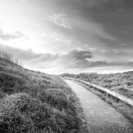

# Landscape Images Colorization

In this project, a deep CNN is built for automatic colorization of images. The model is based on the ResNet-18 classifier and trained on the datasets of pictures of natural landscapes from [Kaggle](https://www.kaggle.com/arnaud58/landscape-pictures). This project is inspired by the image colorization project of [Luke Melas-Kyriazi](https://github.com/lukemelas).

## Sample

Colorization results are shown below:

|   Original Image    |  Grayscale Image   |  Colorized Image   |
| :----------: | :----------: | :----------: |
|  |  |  |
|  |  |  |

